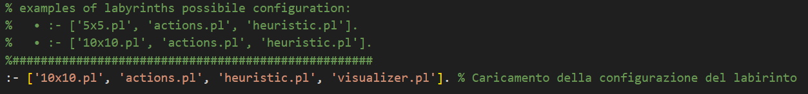
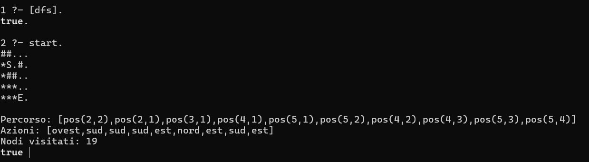

# Risolutore_Labirinto_Prolog

**Risolutore_Labirinto_Prolog** è un sistema sviluppato in Prolog per la risoluzione automatica di labirinti di diverse dimensioni tramite algoritmi di ricerca nello spazio degli stati.  
Il progetto permette di confrontare diverse strategie di esplorazione — tra cui Depth-First Search (DFS), Breadth-First Search (BFS), Iterative Deepening e A* — all’interno di ambienti strutturati come griglie, valutando il numero di stati visitati e le performance di ciascun metodo.

Il sistema è pensato sia come strumento didattico per lo studio delle tecniche classiche di Intelligenza Artificiale, sia come base modulare per l’estensione a problemi più complessi. Gli ambienti di prova sono facilmente personalizzabili grazie a una chiara separazione tra la definizione dei labirinti e la logica di ricerca. Tutte le regole di movimento, la validazione delle azioni e l’inferenza sui percorsi vengono gestite tramite la logica dichiarativa tipica di Prolog.

Il progetto è stato realizzato nell’ambito del corso di **Ingegneria della Conoscenza** presso l’**Università degli Studi di Bari Aldo Moro**.

---
## Struttura del progetto

La struttura delle cartelle e dei file principali del progetto è la seguente:

Risolutore_Labirinto_Prolog/

├── astar.pl  Algoritmo di ricerca A*

├── bfs.pl  Algoritmo Breadth-First Search

├── dfs.pl   Algoritmo Depth-First Search

├── iterative_deepening.pl   Algoritmo Iterative 
Deepening

├── utils.pl   Funzioni di utilità

├── README.md   Documentazione del progetto

└── labyrinth/

├── 10x10.pl   Labirinto di esempio 10x10

├── 5x5.pl   Labirinto di esempio 5x5

├── actions.pl   Definizione delle azioni e regole di movimento

├── heuristic.pl   Funzione euristica per A*

├── loader.pl   Script per caricamento labirinti

└── visualizer.pl   Visualizzazione del percorso

---
## Requisiti e istruzioni per l’esecuzione

### Requisiti

- **Prolog** (consigliato SWI-Prolog):  
  [https://www.swi-prolog.org/](https://www.swi-prolog.org/)
- Sistema operativo Windows, Linux o macOS

### Istruzioni per l’esecuzione

1. **Clona o scarica** la cartella `Risolutore_Labirinto_Prolog` sul tuo computer.
2. **Apri una console/terminale** e posizionati nella directory del progetto.

3. **Avvia SWI-Prolog** digitando il comando:
   ```bash
   swipl

4. **Carica il file dell’algoritmo desiderato.**
Per evitare warning di caricamento, è consigliabile utilizzare la sintassi con gli apici singoli        ['nomefile.pl'].
Ad esempio:

```prolog
  ?- ['astar.pl'].
  ?- ['dfs.pl'].
  ?- ['bfs.pl'].
  ?- ['iterative_deepening.pl'].
```

- Nota: In alcuni casi il comando senza estensione ([bfs].) funziona senza warning, mentre per altri algoritmi può produrre messaggi di warning. L’utilizzo di ['nomefile.pl'] è il più sicuro per tutti i casi.

5. **Configura il labirinto.**
Accedi al file labyrinth/loader.pl e inserisci (o modifica) la configurazione desiderata del labirinto prima di avviare la ricerca (scegli tra i 2 algoritmi 5x5 o 10x10).

6. **Avvia la risoluzione del labirinto con l'algoritmo scelto eseguendo il comando:**

```prolog
  ?- start.
```
  - Questo comando visualizzerà il labirinto risolto nel terminale, evidenziando il percorso trovato con il simbolo **(*)**, lo stato di partenza con **S**, l’arrivo con **E**, e gli ostacoli con **#**.

  - Restituirà la lista delle posizioni che costituiscono il percorso dalla partenza all’arrivo.

  - Indicherà la sequenza delle azioni da compiere (es. nord, sud, est, ovest, ecc.).

  - Riporterà il numero di stati visitati dall’algoritmo selezionato.

  - Nota:
  Modifica il file loader.pl ogni volta che vuoi cambiare la configurazione del labirinto o sperimentare nuove mappe.
   
  ### Output previsto 
  

---
## Autore
Questo progetto è stato sviluppato da Antonio Di Trani, matricola 776806, presso l'Università di Bari (Uniba). È stato svolto durante l'anno accademico 2024-2025 per il corso di Ingegneria della Conoscenza, tenuto dal Professor Nicola Fanizzi.